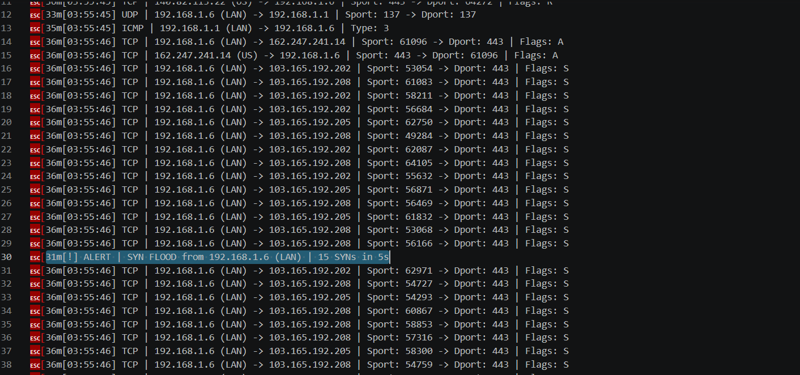
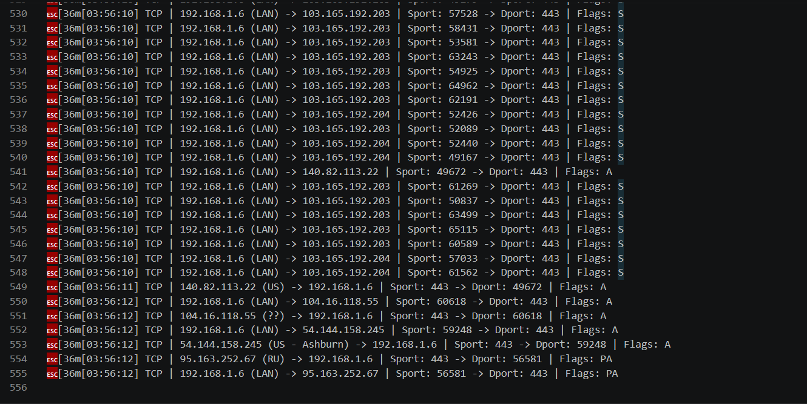

# 🛡️ Network Packet Analyzer

A real-time network traffic monitoring and threat detection tool built with Python and Scapy. Captures live packets directly from the network interface, performs protocol-level analysis, enriches traffic with geolocation intelligence, and detects suspicious activity such as SYN flood attacks and port scans.

The project demonstrates practical knowledge of **computer networks, packet analysis, cybersecurity monitoring, protocol dissection, and anomaly detection**.

---

## 🚀 Project Highlights

- Real-time packet capture using Scapy and libpcap/Npcap
- Deep packet inspection of TCP, UDP, and ICMP traffic
- Protocol dissection across OSI Layers 3–4
- GeoIP enrichment using MaxMind GeoLite2
- Real-time SYN Flood detection
- Real-time Port Scan detection
- Command-line filtering by protocol and IP addresses
- Session logging and traffic statistics
- Lightweight and cross-platform architecture

---

## Live API

**Swagger UI:** https://crypto-api-production-5f2d.up.railway.app/docs

---


## 🏗️ System Architecture

```text
                    ┌─────────────────────┐
                    │ Network Interface   │
                    │ Ethernet / WiFi     │
                    └──────────┬──────────┘
                               │
                               ▼
                    ┌─────────────────────┐
                    │ Scapy Packet Sniffer│
                    │    Live Capture     │
                    └──────────┬──────────┘
                               │
         ┌─────────────────────┼─────────────────────┐
         ▼                     ▼                     ▼

 ┌───────────────┐    ┌────────────────┐    ┌────────────────┐
 │ Protocol      │    │ GeoIP          │    │ Anomaly        │
 │ Dissector     │    │ Enrichment     │    │ Detection      │
 └──────┬────────┘    └──────┬─────────┘    └──────┬─────────┘
        │                    │                     │
        └────────────┬───────┴────────────┬────────┘
                     ▼                    ▼

             ┌──────────────────────────────┐
             │ CLI Output & Session Logs    │
             └─────────────┬────────────────┘
                           ▼

             ┌──────────────────────────────┐
             │ Traffic Summary Statistics   │
             └──────────────────────────────┘
```

---

## 📸 Screenshots

### 🚨 SYN Flood Detection



Automatically detects excessive SYN packets within a configurable sliding time window.

---

### 🌎 GeoIP Enriched Traffic Analysis



Displays geographic intelligence for public IP addresses using MaxMind GeoLite2.

---

## ⚡ Core Features

### 📡 Live Packet Capture

Captures packets directly from the network interface using Scapy's packet sniffing engine.

Supported protocols:

- TCP
- UDP
- ICMP

---

### 🔍 Protocol Dissection

Extracts and displays:

#### Network Layer (OSI Layer 3)

- Source IP Address
- Destination IP Address
- IP Protocol

#### Transport Layer (OSI Layer 4)

- Source Port
- Destination Port
- TCP Flags
- ICMP Message Types

---

### 🌎 GeoIP Intelligence

Public IP addresses are enriched using MaxMind GeoLite2.

Displays:

- Country
- City
- Geographic Origin

Private network traffic is automatically labeled as:

```text
(LAN)
```

---

### 🚨 Threat Detection

#### SYN Flood Detection

Monitors SYN-only TCP packets and identifies excessive connection attempts originating from a single host.

Detection Rule:

```text
15+ SYN packets within 5 seconds
```

---

#### Port Scan Detection

Tracks destination ports contacted by a source host.

Detection Rule:

```text
10+ unique destination ports
```

This helps identify reconnaissance behavior commonly associated with tools such as Nmap.

---

### 📊 Traffic Statistics

When packet capture ends, the analyzer automatically generates a traffic summary including:

- TCP packet count
- UDP packet count
- ICMP packet count
- Total captured packets

---

### 📝 Logging Support

Entire capture sessions can be exported to a text file:

```bash
python analyzing.py --output capture_log.txt
```

---

## 🛠️ Technology Stack

### 🐍 Core Technologies

| Category | Technologies |
|-----------|-------------|
| Language | Python |
| Packet Capture | Scapy |
| Networking | libpcap / Npcap |
| CLI Interface | argparse |
| Terminal Styling | colorama |

---

### 🌐 Security & Analysis

| Category | Technologies |
|-----------|-------------|
| GeoIP Intelligence | MaxMind GeoLite2 |
| Threat Detection | Custom Detection Engine |
| Traffic Analysis | TCP/IP Protocol Parsing |

---

### 🚀 Technology Overview

<p align="left">
  
  
  
  
  
</p>

---

## 📋 Requirements

### Software

- Python 3.8+
- Npcap (Windows)
- Administrator / Root Privileges

### Python Dependencies

```bash
pip install scapy colorama geoip2
```

---

### GeoIP Database

Download:

```text
GeoLite2-City.mmdb
```

from:

https://dev.maxmind.com/geoip/geolite2-free-geolocation-data

Place the file in the project root directory.

---

## 🚀 Usage

### Basic Capture

```bash
python analyzing.py
```

### Filter by Protocol

```bash
python analyzing.py --proto tcp
```

### Filter by Source IP

```bash
python analyzing.py --src 192.168.1.6
```

### Filter by Destination IP

```bash
python analyzing.py --dst 8.8.8.8
```

### Save Capture Log

```bash
python analyzing.py --output log.txt
```

### Auto Stop

```bash
python analyzing.py --duration 30
```

### Combined Example

```bash
python analyzing.py \
    --proto tcp \
    --src 192.168.1.6 \
    --output log.txt \
    --duration 60
```

---

## 📄 Sample Output

```text
[*] Capturing... Filters: proto=any | src=any | dst=any
[*] Anomaly detection: ON (SYN flood + Port scan)
[*] Auto-stop in 60 seconds.

[03:47:12] TCP | 192.168.1.6 (LAN) -> 54.144.158.245 | Sport: 59248 -> Dport: 443 | Flags: PA
[03:47:12] TCP | 54.144.158.245 (US - Ashburn) -> 192.168.1.6 | Sport: 443 -> Dport: 59248 | Flags: A

[!] ALERT | SYN FLOOD from 192.168.1.6 (LAN)
```

---

## 🔬 Real-World Finding

During development, the analyzer repeatedly detected bursts of unanswered SYN packets originating from the local host and targeting the `103.165.192.x` subnet on port 443.

Further investigation revealed that a background application was repeatedly attempting HTTPS connections to an unavailable remote server.

This discovery validated the effectiveness of the anomaly detection engine and demonstrated how the tool can surface abnormal behavior in otherwise ordinary network traffic.

---

## 📂 Project Structure

```text
Network-Packet-Analyzer/
│
├── analyzing.py
├── GeoLite2-City.mmdb
├── log.txt
├── docs/
│   ├── syn_flood_alert.png
│   └── geoip_output.png
│
└── README.md
```

---

## 🎯 Skills Demonstrated

- Computer Networks
- TCP/IP Protocol Analysis
- Cybersecurity Monitoring
- Packet Inspection
- Threat Detection
- Network Traffic Analysis
- Geolocation Intelligence
- Python Development
- CLI Tool Development
- System Programming

---

## 🔮 Future Enhancements

- PCAP file export support
- Wireshark-compatible packet storage
- Web dashboard for traffic visualization
- Machine learning-based anomaly detection
- DNS traffic inspection
- HTTP packet analysis
- Real-time traffic graphs

---
## 👤 Author

**Ashmit Kumar Srivastav**  
GitHub: [@Ashmit](https://github.com/Ashmit76311)
